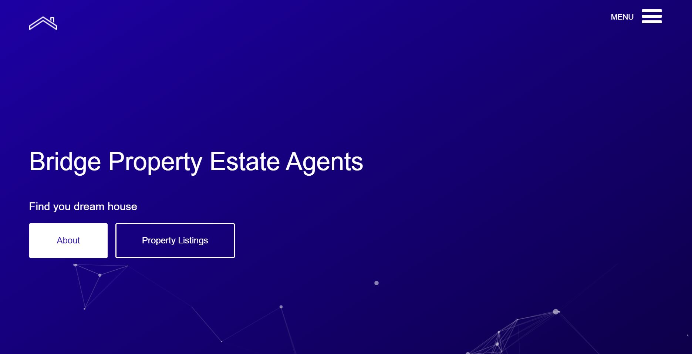

# Bridge Property Estate Agents

Bridge Property Estate Agents is a fictional property business that's located in Celbridge, Kildare. The website is made to allow potential customers to browse houses that are for sale nationwide. If customers are interested in viewing a property, they can get in contact with an estate agent via a form. Staff can then easily manage inquries and listings.
The live link can be found here: [Live Site - Bridge Property Estate Agents](https://bridge-property-estate-agent-e4f2ca60f42a.herokuapp.com/)

## Table of Contents
- [User-Experience-Design](#user-experience-design)
- [Styling](#styling)
- [Technologies](#technologies)
- [Testing](#testing)

# User-Experience-Design

## The-Scope-Plane

* Responsive Design - Site should be fully functional on all devices
* Ability to perform CRUD functionality on Listings
* Restricted role based features
* Home and About pages with listing information

## The-Structure-Plane

### Features

**Navigation Menu**

The following navigation items are available on all pages:
  * About -> about.html - Available to everyone
  * Property Listings -> listings.html - Available to everyone
  * Dashboard -> dashboard.html - Available to everyone
  * Staff Dashboard -> staffdashboard.html - Available to staff only
  * Login -> login.html - Visible to logged out users
  * Register -> register.html - Visible to logged out users
  * Logout -> logout.html - Visible to logged in users

The navigation menu is displayed on all pages as a hamburger icon on all devices, so as to not take up too much space.


**Home Page**

The home page contains a cascading blue colour with a brief description about finding your new home and a button to view listings and view the about page. This will immediately make it evident to the user, what the purpose of the website is.

There is a features section that shows users the website has been used by thousands of people since the business began and the recent listings on offer.

The lastest listings shows the three most recent homes uploaded to the site.

The search form allows users to find a home based on five attributes but they don't have to select them all to find a house.

The next section describes the areas where Bridge Property are industry leaders in.

Next is a photo section that will bring users to the listings page.

The footer contains the site icon that will bring users back to the home page when clicked, and links to the about page and property listings page.




**Footer**

The footer is added to the bottom of the page where a user can find the site icon, about link, property listings link and the social media links for Facebook and Twitter. These icons have aria-labels added to ensure users with assistive screen reading technology know what the purpose of the links are for. They also open in new tabs as they lead users away from the site.


**Create Listing**

When staff are logged into the site, they're able to create new listings without having to go the admin panel. This allows quick updates for both the user and staff.


**Update Listing**

When staff are logged into the site, they're able to update any listings without having to go the admin panel. This allows quick updates for both the user and staff.


**View Listings**

The listings page displays three cards in a row with info on the house and users have the option to see more listings via pagination that has been implemented on this page. This is visible to both logged in users and those just browsing the site.


**Delete Listing**

Staff and logged in users have their own dashboard page where they can see queries about listings. Staff have the option to delete a listing when a house is taken off the market while logged in users can delete a listing they have inquired about.


### Features

**Navbar**

The navbar is located by clicking the hamburger icon which then displays the links for About, Property Listings, Dashboard, Logout when users are logged in. Before users sign in, it will display About, Property Listings, Login, Register.

**Home Page**

The home page contains 

### Site Goals
The site is aimed for estate agents to be able to display a list of houses for sale and have the capacity for updating and removing listings as is necessary.
The site also allows users to view houses on an intuitive and easy to use website. Users can contact estate agents about any house on the site and logged in users are able to see which listings they've inquired about on their dashboard.

### Database-Design
The database was designed to allow CRUD functionality to be available to registered users, when signed in. The user model is at the heart of the application as it is connected to the listings, realtors, account and contact apps, linked by key relationships.

### Security
Environment variables were stored in an env.py for local development for security purposes to ensure no secret keys, api keys or sensitive information was added the the repository. In production, these variables were added to the heroku config vars within the project.

## Styling
### Colour
The main colours used were #1e00a6 and #0c0042 in a linear gradient to the bottom right to produce a dark blue colour.

### Typography
The Nunito font was used throughout the website. This font is from google fonts and was imported into the style sheet.

### Imagery
The Website logo was made using icons8 in white and blue

The listing images were taken from Pexels which is a royalty free image site.

## Technologies
- HTML
  - The structure of the Website was developed using HTML as the main language.
- CSS
  - The Website was styled using custom CSS in an external file.
- Javascript
  - Particle JS was used for the animation
- Python
  - Python was  used for the application using the Django Framework.
- Github
  - Source code is hosted on GitHub
- Git
  - Used to commit and push code during the development of the Website
- CodeAnywhere
  - The website was developed using CodeAnywhere IDE
- Font Awesome
  - This was used for various icons throughout the site
- Icons8
  - This was used for various icons throughout the site
 
**Python Modules Used**
* messages - Used to pass messages to the toasts to display feedback to the user upon actions

**External Python Modules**
* cloudinary==1.29.0 - Cloundinary was set up for use but no custom uploads were made, settings remain for future development
* dj-database-url==0.5.0 - Used to parse database url for production environment
* dj3-cloudinary-storage==0.0.6 - Storage system to work with cloudinary
* Django== - Framework used to build the application
* gunicorn== - Installed as dependency with another package

## Testing
Ensure a user can sign up

Steps:

1. Head over to site, click the hamburger icon to reveal options and click Register
2. Enter details as required
3. Click Register

Expected:

The newly registered user is logged in and brought to the dashboard page

Actual:

The newly registered user is logged in and brought to the dashboard page

<hr>

Ensure a user can log out

Steps:

1. Login to the website
2. Click hamburger icon to reveal logout option and click it
3. User should be redirected to home page

Expected:

User is logged out

Actual:

User is logged out

<hr>

Ensure a user can query a listing

Steps:

1. Either on the home page or on the listings page, click the more info button
2. Click the 'Make An Inquiry' button and a modal will pop up
3. Property line will be populated with listing address
4. Fill out the form, logged in users will have some details prepopulated
5. When all details are filled out click send

Expected:

Form submits, the modal disappears and user is still on the listing page

Actual:

Form submits, the modal disappears and user is still on the listing page

<hr>

Ensure a user booking can be deleted

Steps:

1. Navigate to user dashboard
2. Logged in users can see what listings they've queried
3. Click the delete button
4. A pop up message will ask if you really want to delete this listing
5. Listing will be deleted and user will remain on the dashboard page

Expected:

Listing is deleted and user remains on their dashboard

Actual:

Listing is deleted and user remains on their dashboard

<hr>

Ensure staff can access the staff dashboard

Steps:

1. Click the hamburger icon and click log in
2. Staff are redirected to staff dashboard which shows all listings that have been queried

Expected:

Staff are redirected to the staff dashboard

Actual:

Staff are redirected to the staff dashboard

<hr>

Ensure staff can create a listing when logged into the website

Steps:

1. Click the hamburger icon and click log in
2. Staff are redirected to staff dashboard
3. At the bottom of the page, click 'Create Listing'
4. Staff is redirected to another page with a form allowing them to create a listing
5. If is published is checked and submit button is clicked, the new listing will be available to view
6. When the submit button is clicked, staff will be redirected to the staff dashboard

Expected:

Staff can create a new listing and publish it on the website when logged in

Actual:

Staff can create a new listing and publish it on the website when logged in

<hr>

Ensure staff can update a listing

Steps:

1. Click the hamburger icon and click log in
2. Staff are redirected to staff dashboard
3. Select a listing and click 'Update'
4. Staff is brought to update page with the details prepopulated
5. Select any piece of information that needs to be updated and submit the form
6. Staff is redirected to the home page with the listing being successfully updated

Expected:

Listing will be updated

Actual:

Listing will be updated

<hr>

Ensure staff can delete a listing

Steps:

1. Click the hamburger icon and click log in
2. Staff are redirected to staff dashboard
3. Select a listing and click 'Delete'
4. A pop up message will ask if you really want to delete this listing
5. Listing will be deleted and staff will remain on the staff dashboard

Expected:

Staff can delete a listing

Actual:

Staff can delete a listing

<hr>

Ensure pagination works

Steps:

1. On the listings page, three listings will show and the pagination number will change depending on how many listings are live on the website
2. Click each button to get to the next page
3. On the first/last page, a user or staff can't click the arrow as they are at the start/end of the listings

Expected:

Pagination works for viewing listings

Actual:

Pagination works for viewing listings

<hr>

Ensure site icon is clickable

Steps:

1. Click the site icon when on any other page and be redirected to the home page

Expected:

Site icon brings the user to the home page

Actual:

Site icon brings the user to the home page

<hr>

Ensure all footer links work

Steps:

1. On the footer click either the About or Property Listings link
2. Link will redirect user to respective page

Expected:

Link will redirect user to respective page

Actual:

Link will redirect user to respective page

<hr>

Ensure all navbar links work

Steps:

1. On the footer click either the About or Property Listings link
2. Link will redirect user to respective page

Expected:

Link will redirect user to respective page

Actual:

Link will redirect user to respective page

<hr>

Ensure search bar on home page works

Steps:

1. User can search any listing using the five attributes (keyword/town/province/bedroom/price) or only one if they want
2. User will be redirected to the search page with all associated listings

Expected:

Search bar displays listing/s with attributes selected in the search form

Actual:

Search bar displays listing/s with attributes selected in the search form

<hr>

## Deployment

### Version Control
The site was created using the CodeAnywhere editor and pushed to github to the remote repository
The following git commands were used throughout development to push code to the remote repo:

```git add <file>``` - This command was used to add the file(s) to the staging area before they are committed.

```git commit -m “commit message”``` - This command was used to commit changes to the local repository queue ready for the final step.

```git push``` - This command was used to push all committed code to the remote repository on github.

### Heroku Deployment

The site was deployed to Heroku. The steps to deploy are as follows:
- Navigate to heroku and create an account
- Click the new button in the top right corner
- Select create new app
- Enter app name
- Select region and click create app
- Click the resources tab and search for Heroku Postgres
- Select hobby dev and continue
- Go to the settings tab and then click reveal config vars
- Add the following config vars:
  - SECRET_KEY: (Your secret key)
  - DATABASE_URL: (This should already exist with add on of postgres)
  - CLOUNDINARY_URL: (cloudinary api url)
- Click the deploy tab
- Scroll down to Connect to GitHub and sign in / authorize when prompted
- In the search box, find the repositoy you want to deploy and click connect
- Scroll down to Manual deploy and choose the main branch
- Click deploy

The app should now be deployed.
The live link can be found here:

### Run Locally

Navigate to the GitHub Repository you want to clone to use locally:

- Click on the code drop down button
- Click on HTTPS
- Copy the repository link to the clipboard
- Open your IDE of choice (git must be installed for the next steps)
- Type git clone copied-git-url into the IDE terminal

The project will now have been cloned on your local machine for use.

### Fork Project

Most commonly, forks are used to either propose changes to someone else's project or to use someone else's project as a starting point for your own idea.

- Navigate to the GitHub Repository you want to fork.

- On the top right of the page under the header, click the fork button.

- This will create a duplicate of the full project in your GitHub Repository.
